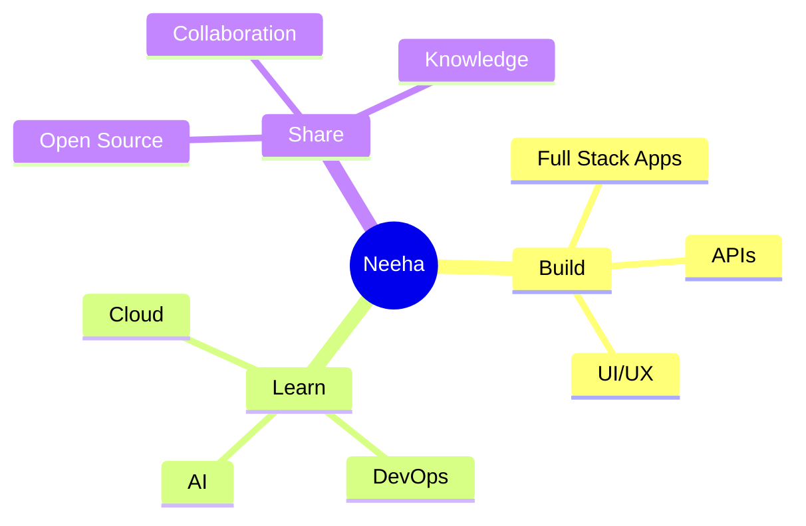

# 👋 Hi, I'm Neeha Nuhu

<div align="center">

### Full Stack Developer • Problem Solver • Lifelong Learner

*"I enjoy transforming ideas into reliable, scalable, and user-friendly software."*

</div>

---

## 📌 Snapshot

| | |
|:---|:---|
| 👩 **Name** | Neeha Nuhu |
| 💻 **Role** | Full Stack Developer |
| 🌍 **Focus** | Modern Web Applications |
| 📍 **Currently Learning** | Cloud Computing • System Design |
| 🎯 **Goal** | Build products that solve real-world problems |

---

## 🚀 What I Do

```text
💡 Design intuitive user experiences
⚙️ Build robust backend services
🌐 Develop responsive web applications
📦 Create maintainable APIs
📈 Continuously improve performance
```

---

## 🛠 Tech Toolbox

### Frontend


### Backend


### Database


---

## 📊 Developer Mindset



---

## 🌱 Current Focus

- 🚀 Building production-ready applications
- 📚 Improving software architecture skills
- ☁️ Learning cloud technologies
- 🤝 Contributing to open source
- 💡 Solving meaningful problems

---

## 📈 Growth Journey

```text
Backend Development      ████████████░░ 85%
Frontend Development     █████████████░ 90%
Database Design          ██████████░░░░ 75%
Cloud Computing          ██████░░░░░░░░ 45%
Problem Solving          ██████████████ 100%
```

---

## 🤝 Let's Collaborate

✨ Full Stack Projects

✨ Startup Ideas

✨ Open Source

✨ Developer Communities

✨ Innovative Web Products

---

## 💬 Favorite Quote

> **"Code is more than instructions for computers—it's a way to create solutions that improve people's lives."**

---

<div align="center">

### Thanks for visiting! ⭐

*If you like my work, consider following my journey.*

</div>
